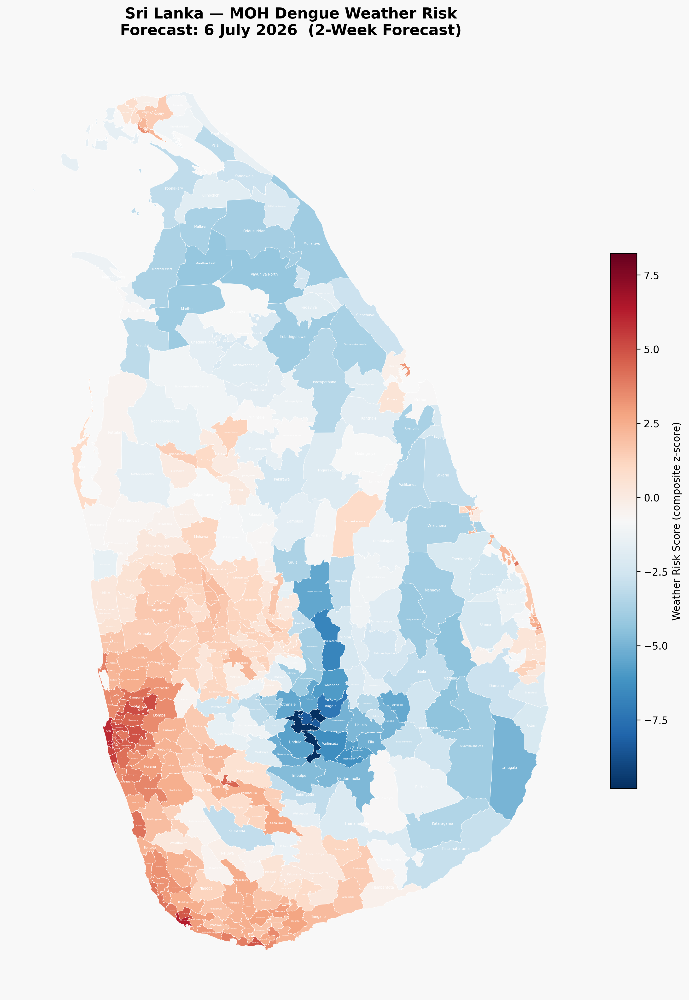
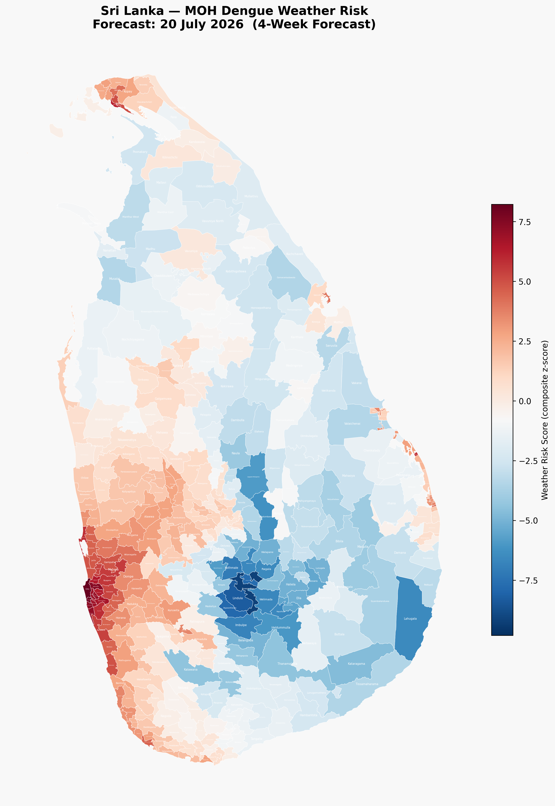
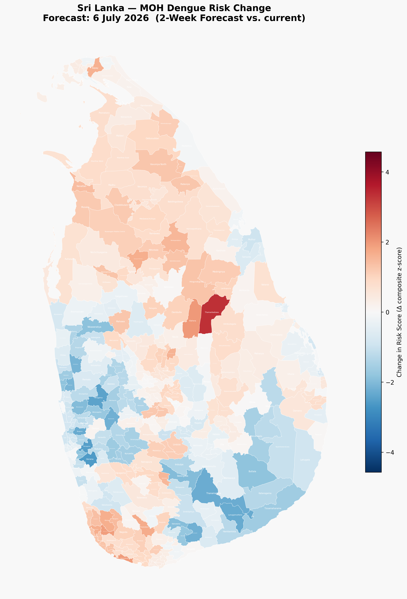
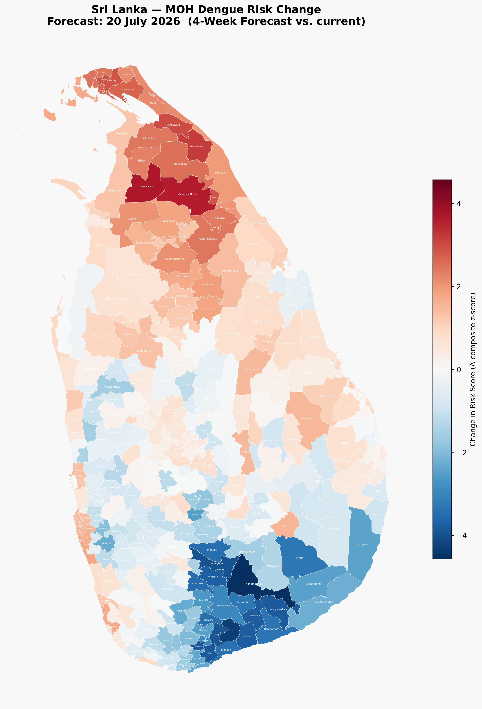

# lk_dengue_weather_model

Dengue outbreak weather-risk model for Sri Lanka MOH regions.

> 📖 **Methodology:** [README.methodology.md](README.methodology.md)

_Last updated: 30 June 2026 · 333 regions with model results._

---

## Risk Map

The choropleth below shows a composite weather-risk score for each MOH
region, derived from the three lagged predictors in Erandi et al. (2021):
weekly rainfall (lag 10 w), mean max temperature (lag 16 w), and mean
min temperature (lag 13 w). Higher scores (red) indicate conditions
associated with higher dengue risk.

---

## Top 20 High-Risk Regions

Sorted by composite weather-risk score (descending).

| Region | District | Risk Score | Rainfall mm (−10w) | Max Temp °C (−16w) | Min Temp °C (−13w) |
|---|---|---:|---:|---:|---:|
| Lunugamvehera | LK-33 | 3.76 | 99.6 | 34.0 | 24.1 |
| Karandeniya | LK-31 | 3.24 | 100.4 | 33.6 | 23.1 |
| Kuruwita | LK-91 | 3.23 | 98.2 | 33.8 | 23.1 |
| Polgahawela | LK-61 | 3.10 | 74.7 | 35.6 | 23.5 |
| Sooriyawewa | LK-33 | 3.08 | 83.2 | 34.3 | 23.8 |
| Welivitiya-Divithura | LK-31 | 3.08 | 102.2 | 33.3 | 22.8 |
| Narammala | LK-61 | 3.07 | 72.9 | 35.6 | 23.6 |
| Kiriella | LK-91 | 3.04 | 98.2 | 33.6 | 22.9 |
| Ayagama | LK-91 | 2.97 | 85.9 | 34.6 | 23.0 |
| Elapatha | LK-91 | 2.97 | 85.9 | 34.6 | 23.0 |
| Pitabeddara | LK-32 | 2.93 | 91.9 | 34.2 | 22.7 |
| Hambantota | LK-33 | 2.92 | 79.4 | 34.0 | 24.1 |
| Elpitiya | LK-31 | 2.90 | 90.1 | 33.9 | 23.0 |
| Panduwasnuwara | LK-61 | 2.79 | 62.9 | 35.4 | 24.1 |
| Pannala | LK-61 | 2.74 | 68.3 | 34.8 | 24.0 |
| Sevanagala | LK-82 | 2.73 | 78.1 | 33.8 | 23.9 |
| Alawwa | LK-61 | 2.72 | 68.0 | 35.4 | 23.4 |
| Baddegama | LK-31 | 2.68 | 96.7 | 32.7 | 23.0 |
| Madurawala | LK-13 | 2.61 | 83.5 | 33.7 | 23.2 |
| Mahara | LK-12 | 2.60 | 71.1 | 34.8 | 23.4 |

> **Note:** Risk scores are weather-only (composite z-score of lagged
> meteorological predictors). Full GLM-based dengue
> incidence prediction requires historical case data (not yet integrated).

---

## Model Validation

Composite weather-risk score vs reported cases/100k (333 regions with available case data).

| Metric | Value |
|---|---:|
| Pearson *r* | 0.2424 |
| Spearman ρ | 0.3759 |
| *p*-value (Pearson) | < 0.001 |
| Regions (*n*) | 333 |

### Top 10 False Positives (high predicted risk, low actual cases)

| Region | District | Risk Score | Cases/100k |
|---|---|---:|---:|
| Lunugamvehera | Hambantota | 3.76 | 0.0 |
| Karandeniya | Galle | 3.24 | 0.0 |
| Polgahawela | Kurunegala | 3.10 | 0.0 |
| Sooriyawewa | Hambantota | 3.08 | 0.0 |
| Welivitiya-Divithura | Galle | 3.08 | 0.0 |
| Narammala | Kurunegala | 3.07 | 0.0 |
| Ayagama | Ratnapura | 2.97 | 0.0 |
| Elapatha | Ratnapura | 2.97 | 0.0 |
| Panduwasnuwara | Kurunegala | 2.79 | 0.0 |
| Sevanagala | Monaragala | 2.73 | 0.0 |

### Top 10 False Negatives (low predicted risk, high actual cases)

| Region | District | Risk Score | Cases/100k |
|---|---|---:|---:|
| Ganga Ihala Korale | Kandy | -2.30 | 92.2 |
| Seeduwa | Gampaha | 0.33 | 86.0 |
| Ja-Ela | Gampaha | 0.18 | 78.3 |
| Dehiwala | Colombo | 0.32 | 70.4 |
| Wattala | Gampaha | 0.18 | 70.3 |
| Nugegoda | Colombo | 0.35 | 63.8 |
| Battaramulla | Colombo | 0.35 | 61.7 |
| Palagala | Anuradhapura | -0.54 | 54.6 |
| Kandy Four Gravets & Gangawata Korale | Kandy | -2.43 | 54.5 |
| Panadura | Kalutara | 0.38 | 51.3 |

---

## Score Threshold Analysis

Proportion of MOH regions with ≥ 10 actual cases/100k among all regions with predicted risk score above a given threshold.

False positive rate (FPR) and false negative rate (FNR) for classifying regions as high-risk (≥ 10 cases/100k) at each threshold.

ROC curve with AUC = 0.7418.

---

## Forward-Looking Forecasts

Dengue weather-risk scores projected 2 and 4 weeks ahead, using the same lagged meteorological predictors applied to already-recorded historical weather.  All three maps (current + forecasts) share an identical colour scale so regional risk levels are directly comparable.

### 2-Week Forecast (13 July 2026)

### 4-Week Forecast (27 July 2026)

### Change from Current — 2-Week Delta

Blue regions show a projected **decrease** in risk; red regions show a projected **increase**.

### Change from Current — 4-Week Delta

---

## Data Sources

- **Weather:** [Open-Meteo Historical Weather API](https://open-meteo.com/en/docs/historical-weather-api)
  (ERA5 / ERA5-Land reanalysis, 0.1°–0.25° resolution)
- **Region boundaries:** Ministry of Health Sri Lanka (333 MOH regions)
- **Model:** Erandi et al. (2021), *Int. J. Dynamical Systems and Differential Equations*, Vol. 11, Nos. 5/6, pp. 462–472.
