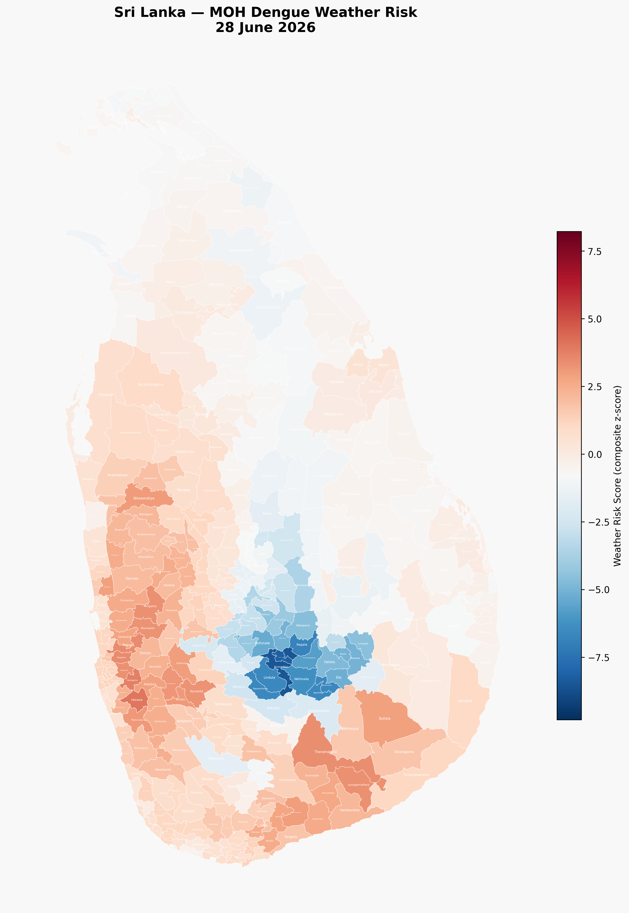
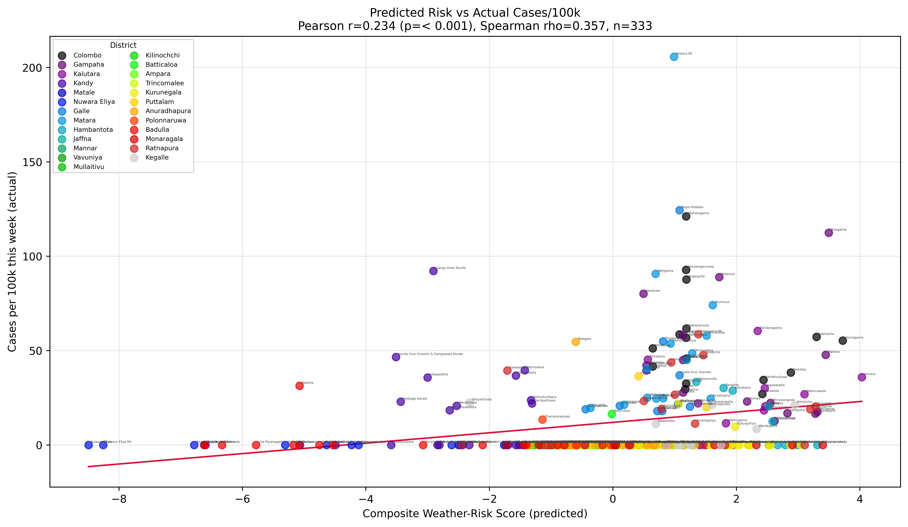
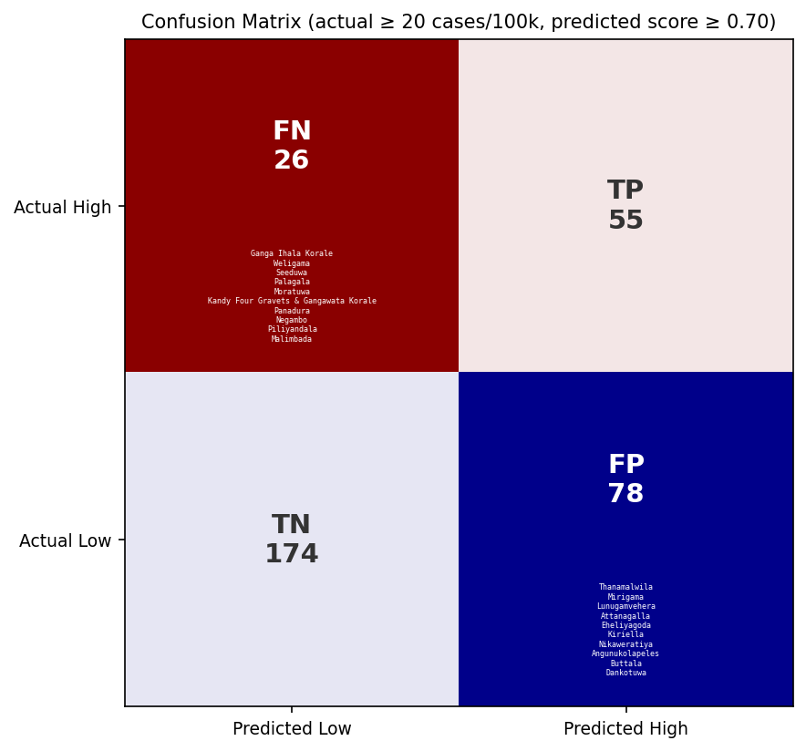
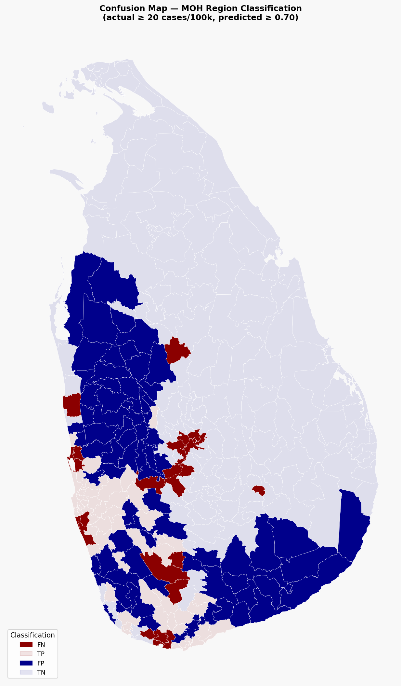
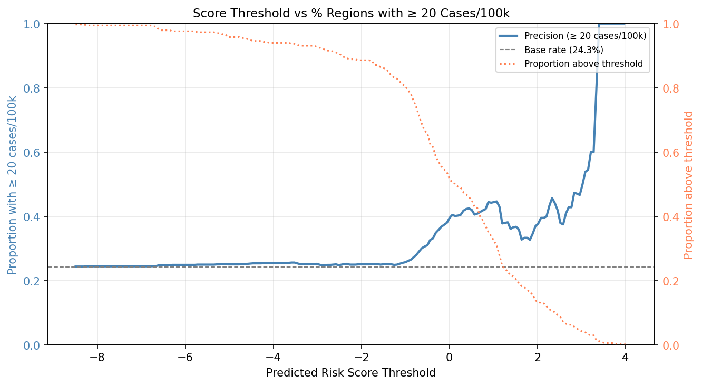
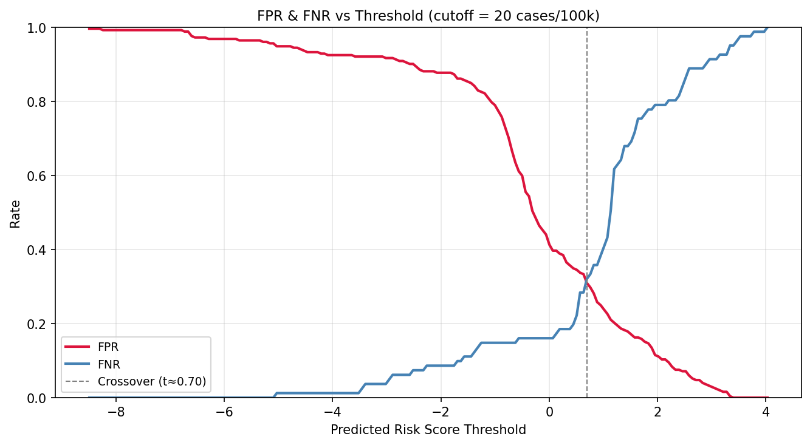
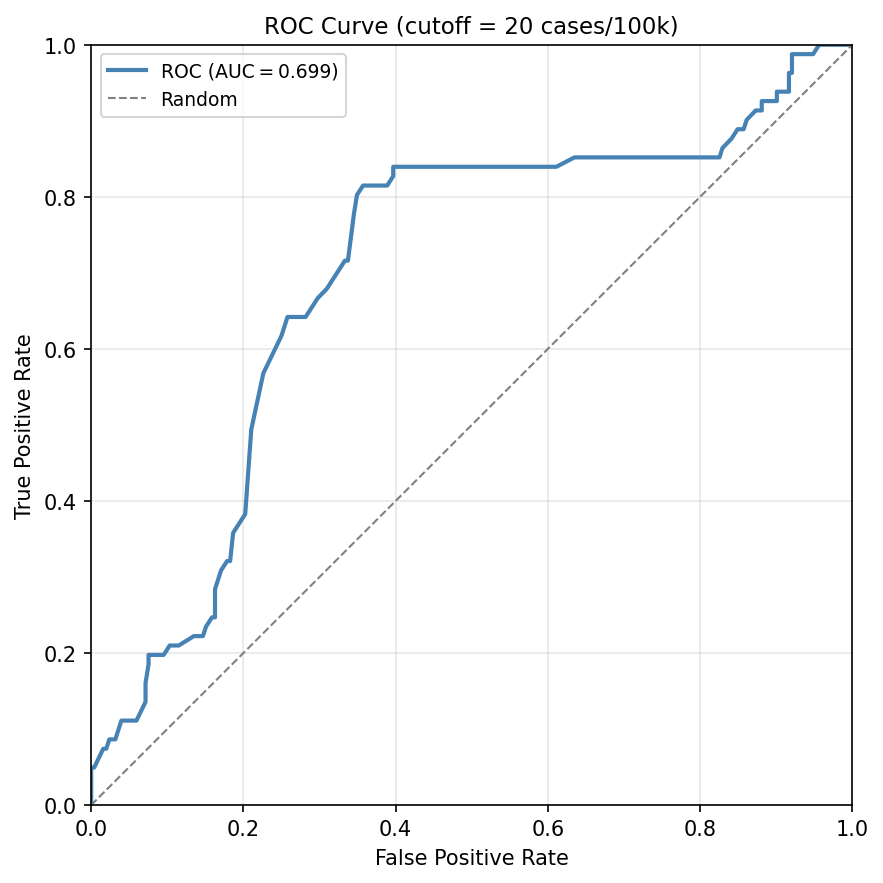

# lk_dengue_weather_model

Dengue outbreak weather-risk model for Sri Lanka MOH regions.

> 📖 **Methodology:** [README.methodology.md](README.methodology.md)

_Last updated: 26 June 2026 · 333 regions with model results._

---

## Risk Map

The choropleth below shows a composite weather-risk score for each MOH
region, derived from the three lagged predictors in Erandi et al. (2021):
weekly rainfall (lag 10 w), mean max temperature (lag 16 w), and mean
min temperature (lag 13 w). Higher scores (red) indicate conditions
associated with higher dengue risk.

---

## Top 20 High-Risk Regions

Sorted by composite weather-risk score (descending).

| Region | District | Risk Score | Rainfall mm (−10w) | Max Temp °C (−16w) | Min Temp °C (−13w) |
|---|---|---:|---:|---:|---:|
| Horana | LK-13 | 4.03 | 64.2 | 32.6 | 23.1 |
| Homagama | LK-11 | 3.72 | 55.2 | 33.5 | 23.1 |
| Biyagama | LK-12 | 3.50 | 43.3 | 34.5 | 24.0 |
| Mahara | LK-12 | 3.45 | 37.5 | 35.8 | 23.6 |
| Thanamalwila | LK-82 | 3.40 | 52.2 | 34.4 | 21.9 |
| Lunugamvehera | LK-33 | 3.31 | 47.1 | 32.8 | 24.6 |
| Mirigama | LK-12 | 3.31 | 35.4 | 36.0 | 23.5 |
| Kaduwela | LK-11 | 3.30 | 46.3 | 33.6 | 23.8 |
| Kuruwita | LK-91 | 3.28 | 48.9 | 33.8 | 23.0 |
| Attanagalla | LK-12 | 3.28 | 35.0 | 36.0 | 23.5 |
| Eheliyagoda | LK-91 | 3.20 | 45.7 | 34.4 | 22.8 |
| Kiriella | LK-91 | 3.11 | 48.9 | 33.5 | 22.8 |
| Madurawala | LK-13 | 3.10 | 54.2 | 32.1 | 23.3 |
| Nikaweratiya | LK-61 | 3.04 | 42.8 | 33.3 | 24.2 |
| Angunukolapeles | LK-33 | 2.99 | 45.2 | 33.5 | 23.3 |
| Dehiovita | LK-92 | 2.95 | 46.9 | 34.8 | 21.4 |
| Buttala | LK-82 | 2.91 | 48.3 | 32.8 | 23.2 |
| Padukka | LK-11 | 2.88 | 44.0 | 33.8 | 22.9 |
| Dankotuwa | LK-62 | 2.87 | 38.9 | 34.3 | 23.4 |
| Gampaha | LK-12 | 2.83 | 35.4 | 34.6 | 23.7 |

> **Note:** Risk scores are weather-only (composite z-score of lagged
> meteorological predictors). Full GLM-based dengue
> incidence prediction requires historical case data (not yet integrated).

---

## Model Validation

Composite weather-risk score vs reported cases/100k (333 regions with available case data).

| Metric | Value |
|---|---:|
| Pearson *r* | 0.2343 |
| Spearman ρ | 0.3569 |
| *p*-value (Pearson) | < 0.001 |
| Regions (*n*) | 333 |

### Top 10 False Positives (high predicted risk, low actual cases)

| Region | District | Risk Score | Cases/100k |
|---|---|---:|---:|
| Thanamalwila | Monaragala | 3.40 | 0.0 |
| Mirigama | Gampaha | 3.31 | 17.6 |
| Lunugamvehera | Hambantota | 3.31 | 0.0 |
| Attanagalla | Gampaha | 3.28 | 16.6 |
| Eheliyagoda | Ratnapura | 3.20 | 18.9 |
| Kiriella | Ratnapura | 3.11 | 0.0 |
| Nikaweratiya | Kurunegala | 3.04 | 0.0 |
| Angunukolapeles | Hambantota | 2.99 | 0.0 |
| Buttala | Monaragala | 2.91 | 0.0 |
| Dankotuwa | Puttalam | 2.87 | 0.0 |

### Top 10 False Negatives (low predicted risk, high actual cases)

| Region | District | Risk Score | Cases/100k |
|---|---|---:|---:|
| Ganga Ihala Korale | Kandy | -2.91 | 92.2 |
| Weligama | Matara | 0.69 | 90.6 |
| Seeduwa | Gampaha | 0.50 | 80.1 |
| Palagala | Anuradhapura | -0.60 | 54.6 |
| Moratuwa | Colombo | 0.65 | 51.2 |
| Kandy Four Gravets & Gangawata Korale | Kandy | -3.51 | 46.6 |
| Panadura | Kalutara | 0.57 | 45.3 |
| Negambo | Gampaha | 0.54 | 42.1 |
| Piliyandala | Colombo | 0.65 | 41.6 |
| Malimbada | Matara | 0.56 | 40.4 |

---

## Score Threshold Analysis

Proportion of MOH regions with ≥ 20 actual cases/100k among all regions with predicted risk score above a given threshold.

False positive rate (FPR) and false negative rate (FNR) for classifying regions as high-risk (≥ 20 cases/100k) at each threshold.

ROC curve with AUC = 0.6993.

---

## Data Sources

- **Weather:** [Open-Meteo Historical Weather API](https://open-meteo.com/en/docs/historical-weather-api)
  (ERA5 / ERA5-Land reanalysis, 0.1°–0.25° resolution)
- **Region boundaries:** Ministry of Health Sri Lanka (333 MOH regions)
- **Model:** Erandi et al. (2021), *Int. J. Dynamical Systems and Differential Equations*, Vol. 11, Nos. 5/6, pp. 462–472.
