# lk_dengue_weather_model

Dengue outbreak weather-risk model for Sri Lanka MOH regions.

> 📖 **Methodology:** [README.methodology.md](README.methodology.md)

_Last updated: 3 September 2026 · 333 regions with model results._

---

## Risk Map

The choropleth below shows a composite weather-risk score for each MOH
region, derived from the three lagged predictors in Erandi et al. (2021):
weekly rainfall (lag 10 w), mean max temperature (lag 16 w), and mean
min temperature (lag 13 w). Higher scores (red) indicate conditions
associated with higher dengue risk.

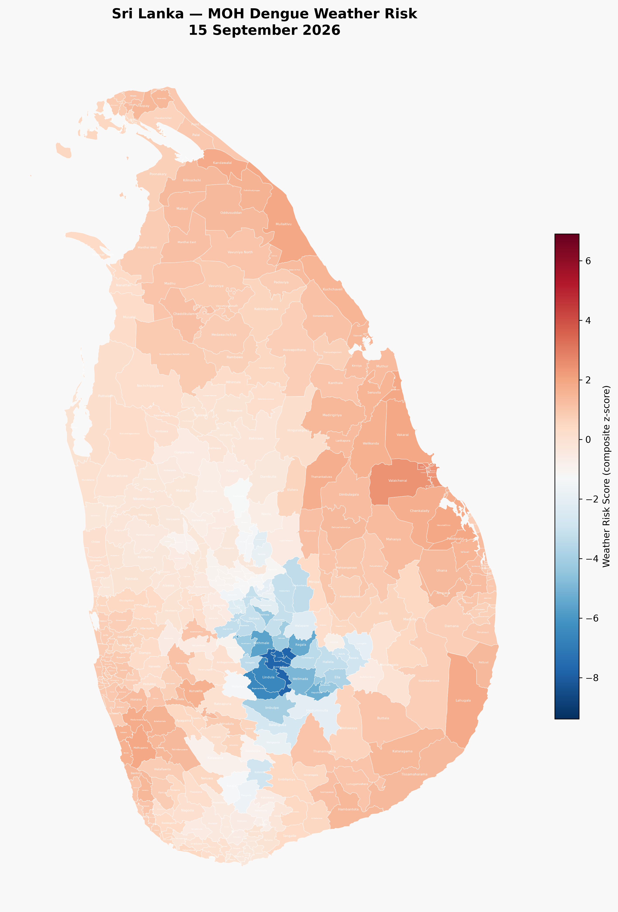

---

## Top 20 High-Risk Regions

Sorted by composite weather-risk score (descending).

| Region | District | Risk Score | Rainfall mm (−10w) | Max Temp °C (−16w) | Min Temp °C (−13w) |
|---|---|---:|---:|---:|---:|
| Piliyandala | LK-11 | 2.90 | 129.5 | 30.0 | 26.4 |
| Moratuwa | LK-11 | 2.90 | 129.5 | 30.0 | 26.4 |
| Boralesgamuwa | LK-11 | 2.83 | 127.4 | 29.9 | 26.5 |
| Maharagama | LK-11 | 2.83 | 127.4 | 29.9 | 26.5 |
| Pitakotte | LK-11 | 2.83 | 127.4 | 29.9 | 26.5 |
| Rathmalana | LK-11 | 2.83 | 127.4 | 29.9 | 26.5 |
| Bandaragama | LK-13 | 2.82 | 147.5 | 29.9 | 25.3 |
| Kuruwita | LK-91 | 2.78 | 177.1 | 29.5 | 24.0 |
| Dehiwala | LK-11 | 2.72 | 127.4 | 29.8 | 26.3 |
| Kahathuduwa | LK-11 | 2.68 | 152.0 | 29.7 | 25.0 |
| Panadura | LK-13 | 2.66 | 119.2 | 30.1 | 26.3 |
| Ratnapura-Mc | LK-91 | 2.62 | 148.7 | 30.4 | 24.2 |
| Battaramulla | LK-11 | 2.58 | 121.0 | 29.7 | 26.5 |
| Kolonnawa | LK-11 | 2.58 | 121.0 | 29.7 | 26.5 |
| Nugegoda | LK-11 | 2.58 | 121.0 | 29.7 | 26.5 |
| Kiriella | LK-91 | 2.57 | 177.1 | 29.3 | 23.8 |
| CMC | LK-11 | 2.53 | 121.0 | 29.7 | 26.4 |
| Eheliyagoda | LK-91 | 2.48 | 176.8 | 29.2 | 23.7 |
| Dehiovita | LK-92 | 2.33 | 173.5 | 29.2 | 23.5 |
| Kalutara | LK-13 | 2.33 | 126.0 | 29.6 | 25.7 |

> **Note:** Risk scores are weather-only (composite z-score of lagged
> meteorological predictors). Full GLM-based dengue
> incidence prediction requires historical case data (not yet integrated).

---

## Model Validation

Composite weather-risk score vs reported cases/100k (333 regions with available case data).

| Metric | Value |
|---|---:|
| Pearson *r* | 0.1276 |
| Spearman ρ | 0.1855 |
| *p*-value (Pearson) | 0.020 |
| Regions (*n*) | 333 |

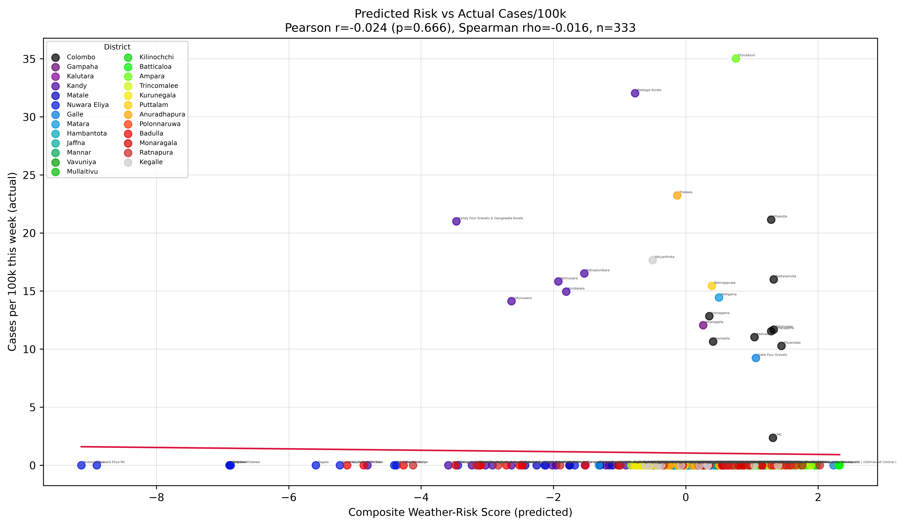

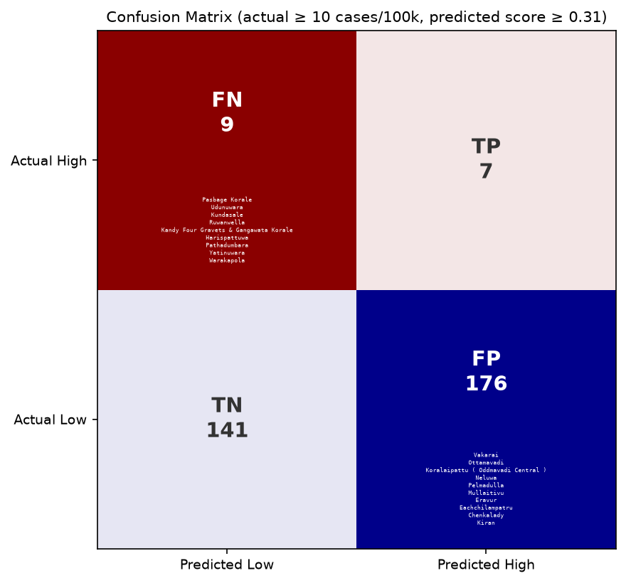

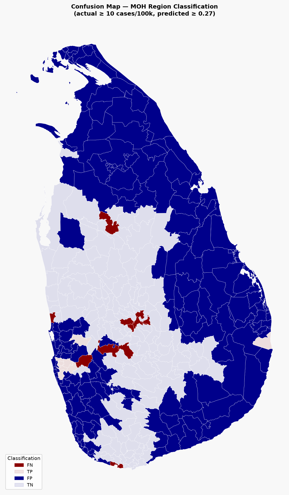

### Top 10 False Positives (high predicted risk, low actual cases)

| Region | District | Risk Score | Cases/100k |
|---|---|---:|---:|
| Moratuwa | Colombo | 2.90 | 9.4 |
| Rathmalana | Colombo | 2.83 | 0.0 |
| Bandaragama | Kalutara | 2.82 | 8.9 |
| Kahathuduwa | Colombo | 2.68 | 9.8 |
| Ratnapura-Mc | Ratnapura | 2.62 | 0.0 |
| Kiriella | Ratnapura | 2.57 | 0.0 |
| CMC | Colombo | 2.53 | 2.2 |
| Eheliyagoda | Ratnapura | 2.48 | 0.0 |
| Dehiovita | Kegalle | 2.33 | 0.0 |
| Biyagama | Gampaha | 2.07 | 0.0 |

### Top 10 False Negatives (low predicted risk, high actual cases)

| Region | District | Risk Score | Cases/100k |
|---|---|---:|---:|
| Yatiyanthota | Kegalle | -1.26 | 40.2 |
| Pasbage Korale | Kandy | -2.36 | 27.5 |
| Bambaradeniya | Kandy | -2.23 | 25.1 |
| Ruwanwella | Kegalle | -0.10 | 22.8 |
| Kandy Four Gravets & Gangawata Korale | Kandy | -3.29 | 20.3 |
| Katuwana | Hambantota | -0.55 | 19.2 |
| Kundasale | Kandy | -1.92 | 17.7 |
| Yatinuwara | Kandy | -1.19 | 16.7 |
| Harispattuwa | Kandy | -1.58 | 15.7 |
| Udunuwara | Kandy | -2.23 | 15.5 |

---

## Score Threshold Analysis

Proportion of MOH regions with ≥ 10 actual cases/100k among all regions with predicted risk score above a given threshold.

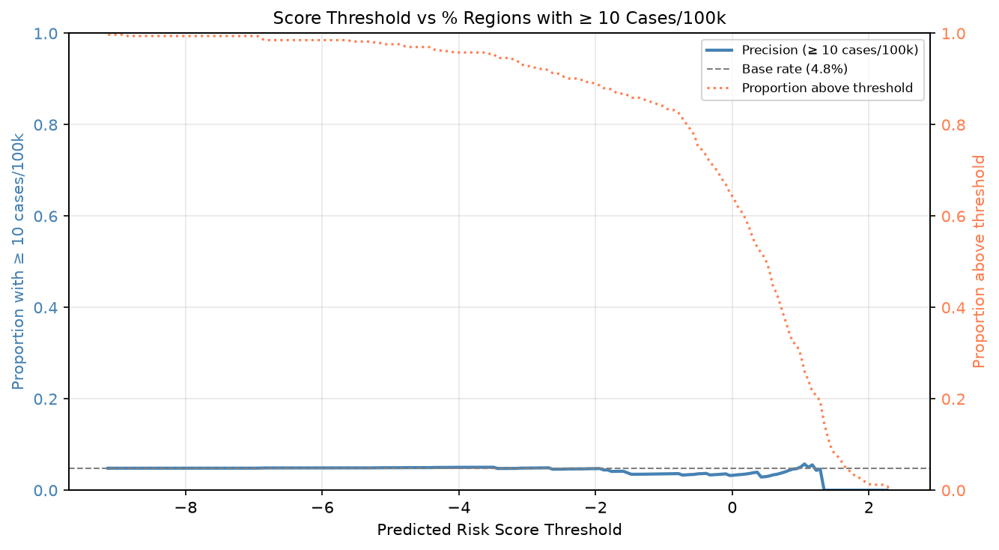

False positive rate (FPR) and false negative rate (FNR) for classifying regions as high-risk (≥ 10 cases/100k) at each threshold.

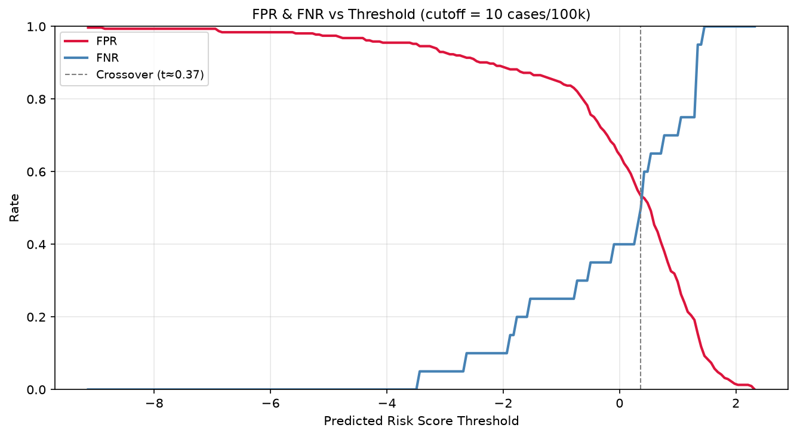

ROC curve with AUC = 0.6241.

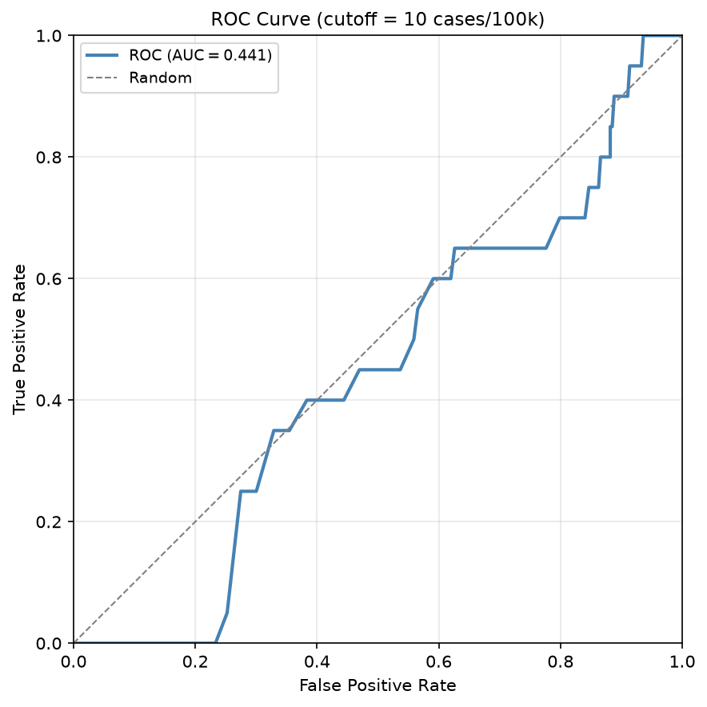

---

## Forward-Looking Forecasts

Dengue weather-risk scores projected 2 and 4 weeks ahead, using the same lagged meteorological predictors applied to already-recorded historical weather.  All three maps (current + forecasts) share an identical colour scale so regional risk levels are directly comparable.

### 2-Week Forecast (14 September 2026)

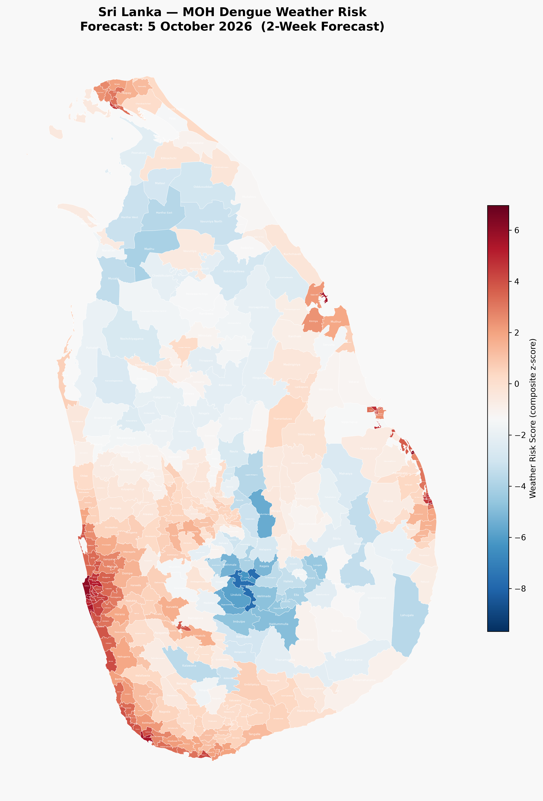

### 4-Week Forecast (28 September 2026)

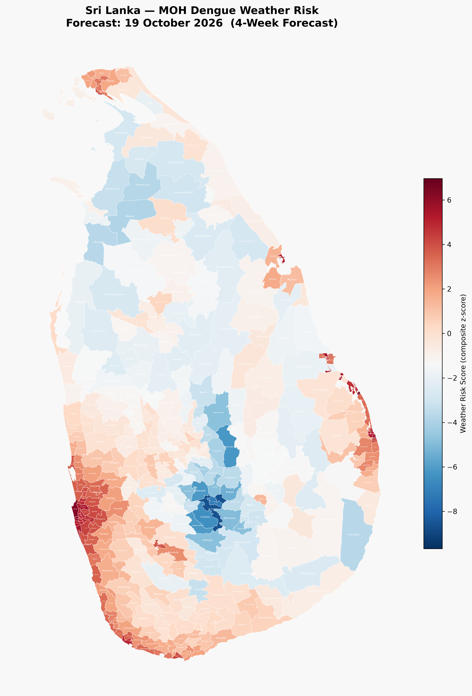

### Change from Current — 2-Week Delta

Blue regions show a projected **decrease** in risk; red regions show a projected **increase**.

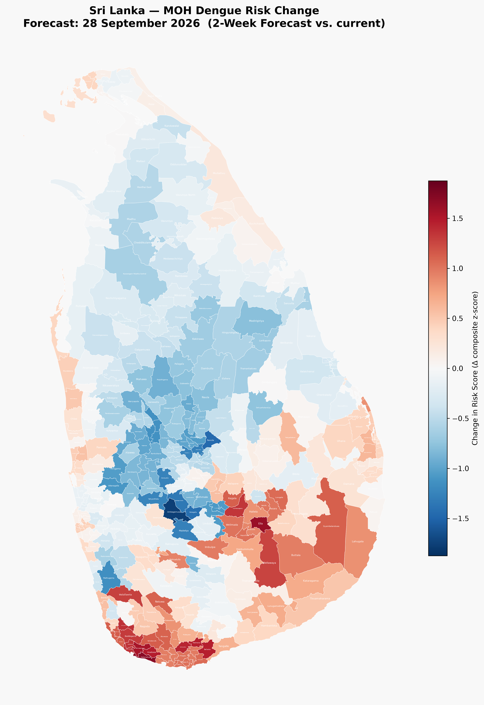

### Change from Current — 4-Week Delta

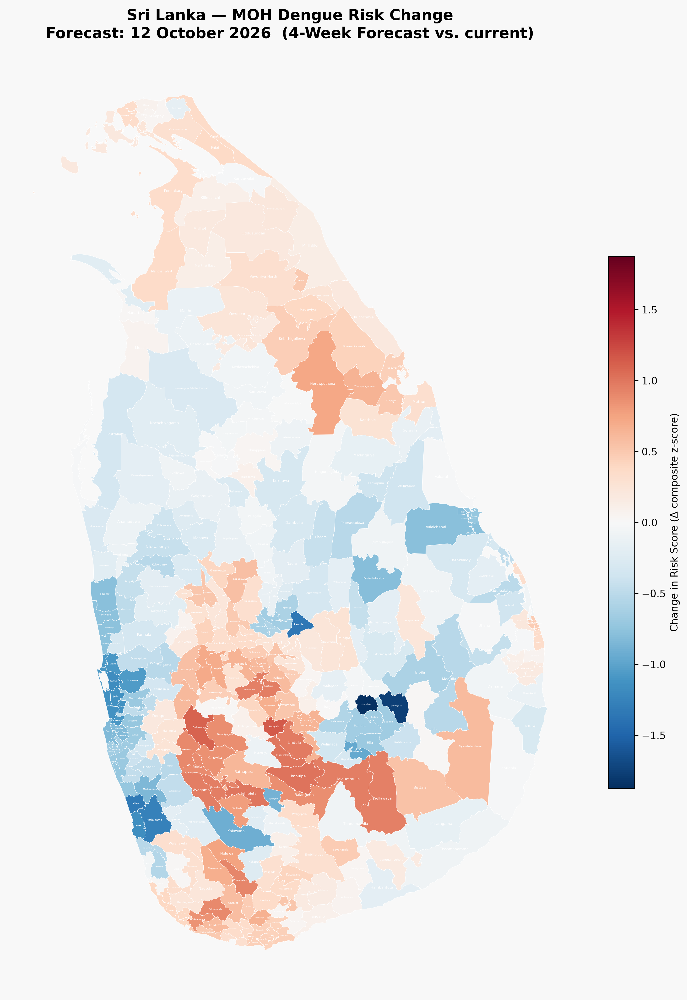

---

## Data Sources

- **Weather:** [Open-Meteo Historical Weather API](https://open-meteo.com/en/docs/historical-weather-api)
  (ERA5 / ERA5-Land reanalysis, 0.1°–0.25° resolution)
- **Region boundaries:** Ministry of Health Sri Lanka (333 MOH regions)
- **Model:** Erandi et al. (2021), *Int. J. Dynamical Systems and Differential Equations*, Vol. 11, Nos. 5/6, pp. 462–472.
