# lk_dengue_weather_model

Dengue outbreak weather-risk model for Sri Lanka MOH regions.

> 📖 **Methodology:** [README.methodology.md](README.methodology.md)

_Last updated: 10 October 2026 · 333 regions with model results._

---

## Risk Map

The choropleth below shows a composite weather-risk score for each MOH
region, derived from the three lagged predictors in Erandi et al. (2021):
weekly rainfall (lag 10 w), mean max temperature (lag 16 w), and mean
min temperature (lag 13 w). Higher scores (red) indicate conditions
associated with higher dengue risk.

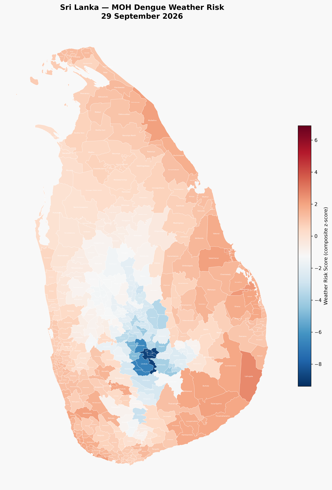

---

## Top 20 High-Risk Regions

Sorted by composite weather-risk score (descending).

| Region | District | Risk Score | Rainfall mm (−10w) | Max Temp °C (−16w) | Min Temp °C (−13w) |
|---|---|---:|---:|---:|---:|
| Eachchilampatru | LK-53 | 2.38 | 40.9 | 34.8 | 27.1 |
| Trincomalee | LK-53 | 2.23 | 33.9 | 34.8 | 27.2 |
| Uppuveli | LK-53 | 2.20 | 34.9 | 34.7 | 27.1 |
| Kuchchaveli | LK-53 | 2.11 | 33.1 | 34.5 | 27.2 |
| Muthur | LK-53 | 2.07 | 34.2 | 34.5 | 27.0 |
| Vakarai | LK-51 | 2.03 | 14.8 | 35.2 | 27.5 |
| Kinniya | LK-53 | 2.00 | 28.3 | 34.6 | 27.1 |
| Hikkaduwa | LK-31 | 1.92 | 121.4 | 29.4 | 26.0 |
| Gonapinuwala | LK-31 | 1.90 | 121.4 | 29.4 | 26.0 |
| Rathgama | LK-31 | 1.84 | 121.4 | 29.3 | 25.9 |
| Valaichenai | LK-51 | 1.81 | 11.3 | 35.4 | 26.9 |
| Kiran | LK-51 | 1.79 | 14.6 | 35.0 | 27.1 |
| Ambalangoda | LK-31 | 1.77 | 107.7 | 29.4 | 26.5 |
| Mullaitivu | LK-44 | 1.75 | 11.9 | 34.8 | 27.2 |
| Kataragama | LK-82 | 1.74 | 25.6 | 34.6 | 26.6 |
| Welikanda | LK-72 | 1.73 | 8.2 | 35.0 | 27.3 |
| Balapitiya | LK-31 | 1.71 | 114.6 | 29.3 | 26.0 |
| Puthukkudiyiruppu | LK-44 | 1.68 | 12.6 | 34.5 | 27.3 |
| Seruvila | LK-53 | 1.67 | 23.0 | 34.3 | 26.9 |
| Thamankaduwa | LK-72 | 1.63 | 4.9 | 34.8 | 27.4 |

> **Note:** Risk scores are weather-only (composite z-score of lagged
> meteorological predictors). Full GLM-based dengue
> incidence prediction requires historical case data (not yet integrated).

---

## Model Validation

Composite weather-risk score vs reported cases/100k (333 regions with available case data).

| Metric | Value |
|---|---:|
| Pearson *r* | -0.0814 |
| Spearman ρ | -0.1134 |
| *p*-value (Pearson) | 0.138 |
| Regions (*n*) | 333 |

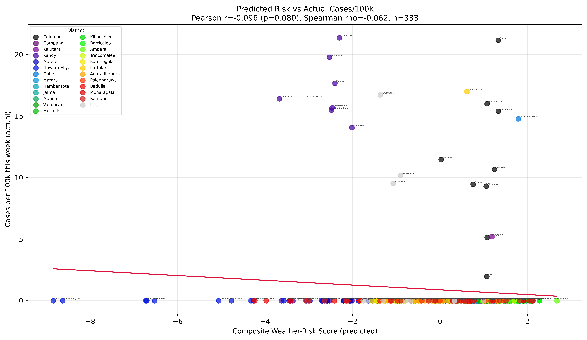

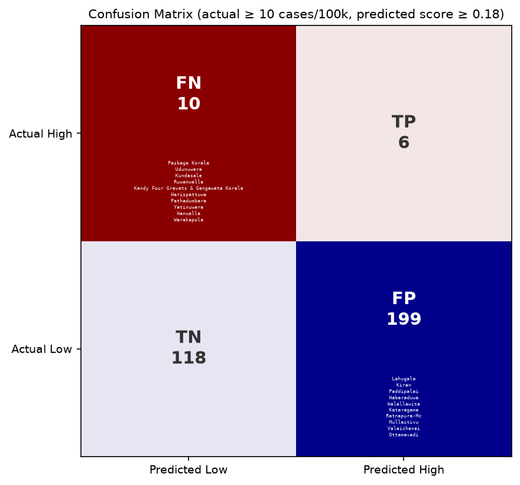

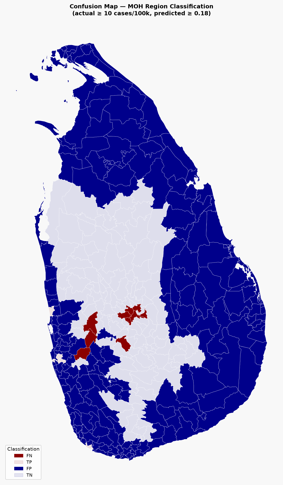

### Top 10 False Positives (high predicted risk, low actual cases)

| Region | District | Risk Score | Cases/100k |
|---|---|---:|---:|
| Eachchilampatru | Trincomalee | 2.38 | 0.0 |
| Trincomalee | Trincomalee | 2.23 | 0.0 |
| Uppuveli | Trincomalee | 2.20 | 0.0 |
| Kuchchaveli | Trincomalee | 2.11 | 0.0 |
| Muthur | Trincomalee | 2.07 | 0.0 |
| Vakarai | Batticaloa | 2.03 | 0.0 |
| Kinniya | Trincomalee | 2.00 | 0.0 |
| Hikkaduwa | Galle | 1.92 | 0.0 |
| Gonapinuwala | Galle | 1.90 | 0.0 |
| Rathgama | Galle | 1.84 | 0.0 |

### Top 10 False Negatives (low predicted risk, high actual cases)

| Region | District | Risk Score | Cases/100k |
|---|---|---:|---:|
| Pasbage Korale | Kandy | -1.24 | 21.4 |
| Udunuwara | Kandy | -1.80 | 19.8 |
| Kundasale | Kandy | -1.59 | 17.7 |
| Wennappuwa | Puttalam | -0.07 | 17.0 |
| Ruwanwella | Kegalle | -0.71 | 16.7 |
| Kandy Four Gravets & Gangawata Korale | Kandy | -2.96 | 16.4 |
| Harispattuwa | Kandy | -1.81 | 15.7 |
| Pathadumbara | Kandy | -1.84 | 15.5 |
| Yatinuwara | Kandy | -1.00 | 14.1 |
| Warakapola | Kegalle | -0.11 | 10.2 |

---

## Score Threshold Analysis

Proportion of MOH regions with ≥ 10 actual cases/100k among all regions with predicted risk score above a given threshold.

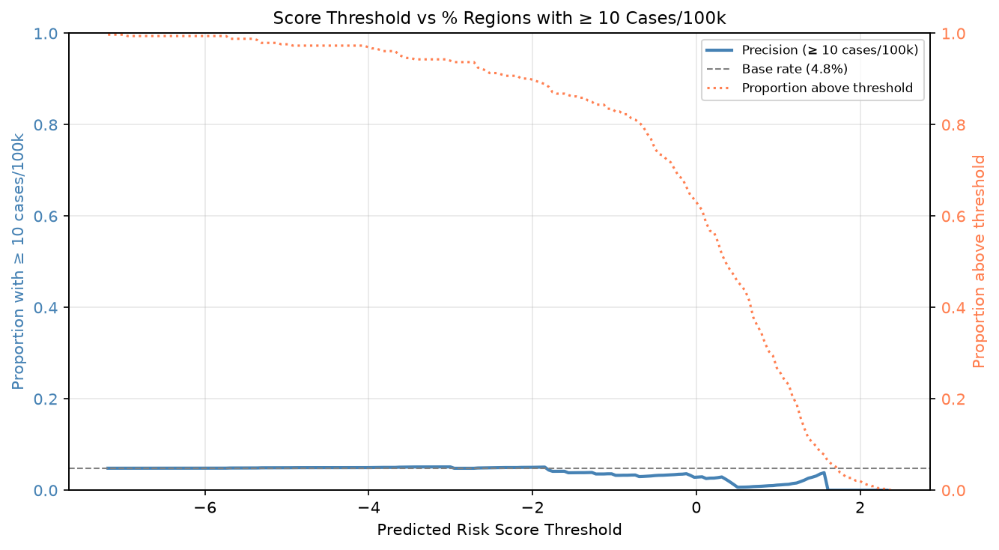

False positive rate (FPR) and false negative rate (FNR) for classifying regions as high-risk (≥ 10 cases/100k) at each threshold.

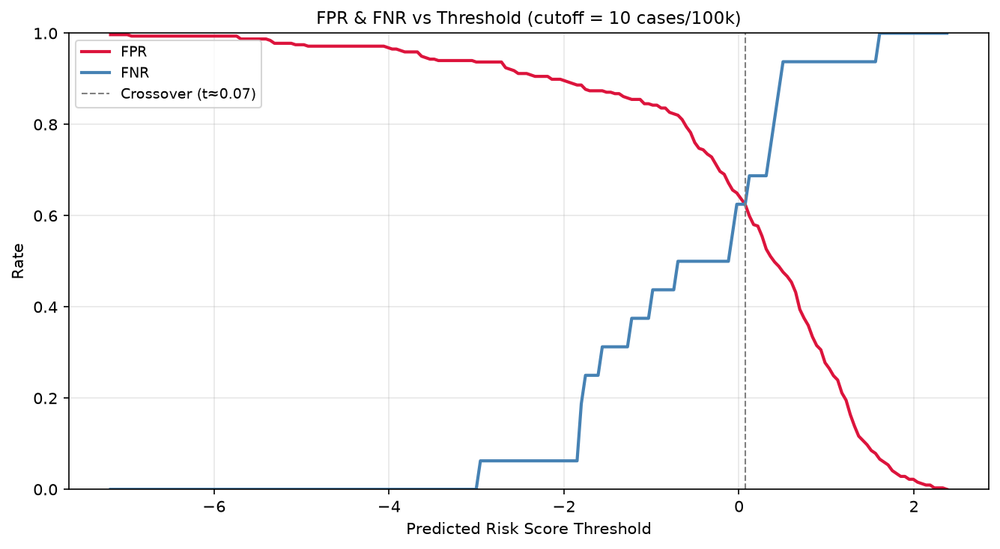

ROC curve with AUC = 0.3132.

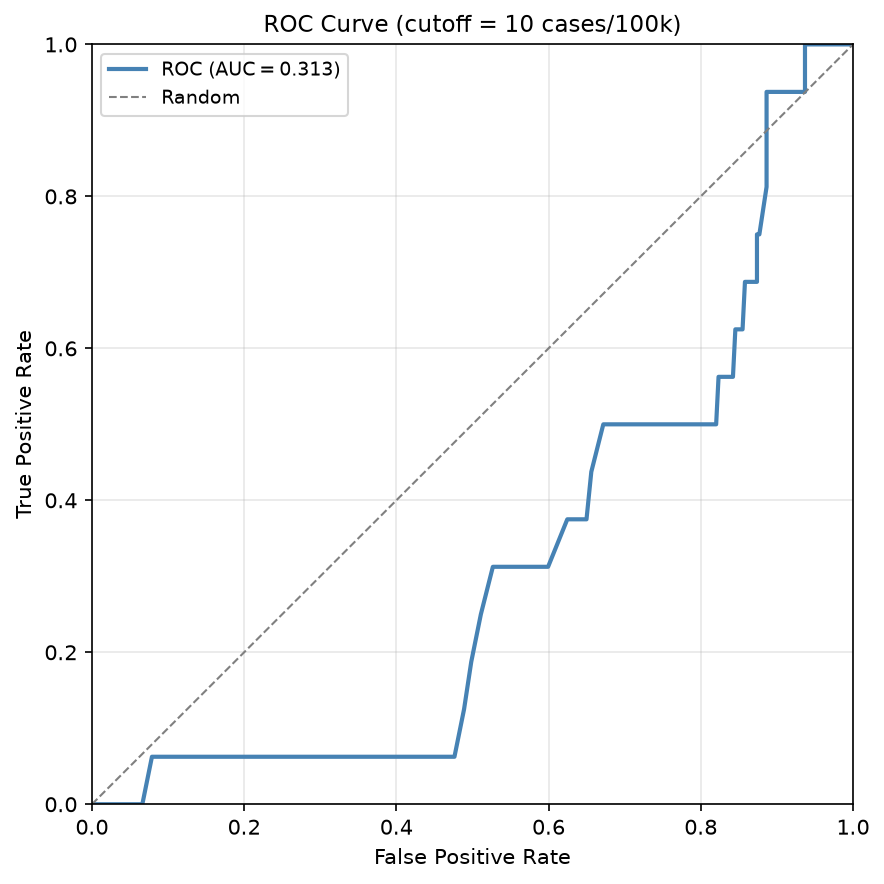

---

## Forward-Looking Forecasts

Dengue weather-risk scores projected 2 and 4 weeks ahead, using the same lagged meteorological predictors applied to already-recorded historical weather.  All three maps (current + forecasts) share an identical colour scale so regional risk levels are directly comparable.

### 2-Week Forecast (19 October 2026)

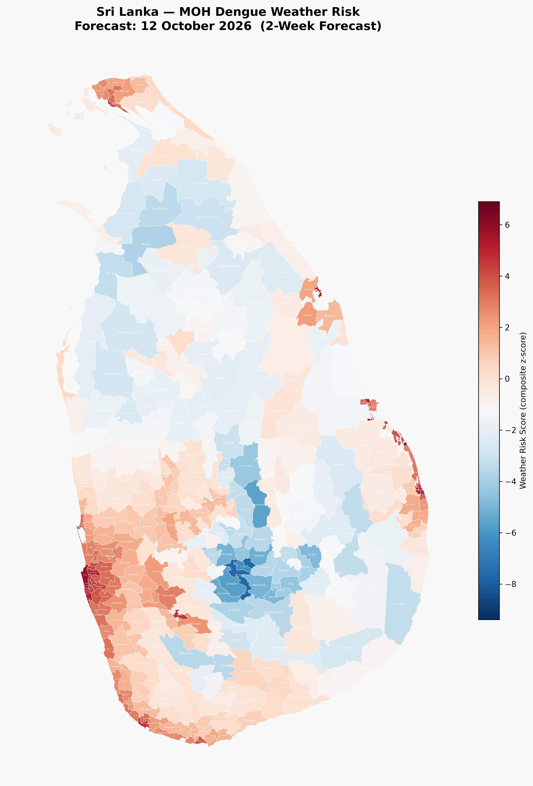

### 4-Week Forecast (2 November 2026)

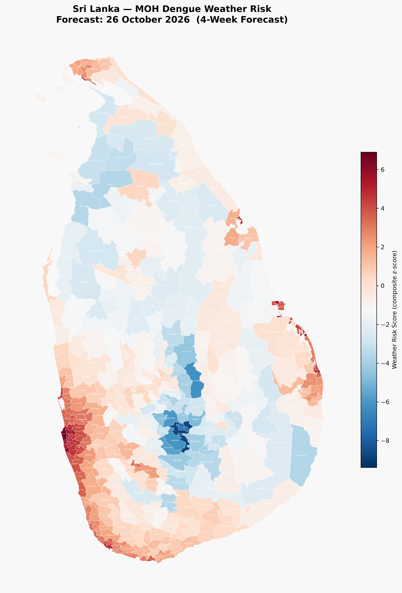

### Change from Current — 2-Week Delta

Blue regions show a projected **decrease** in risk; red regions show a projected **increase**.

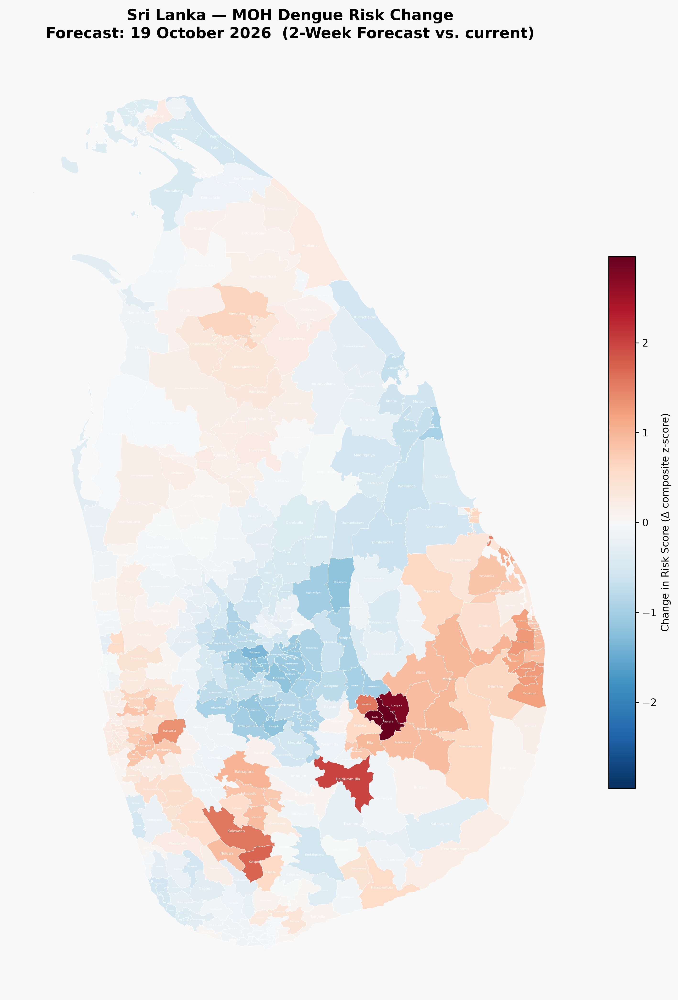

### Change from Current — 4-Week Delta

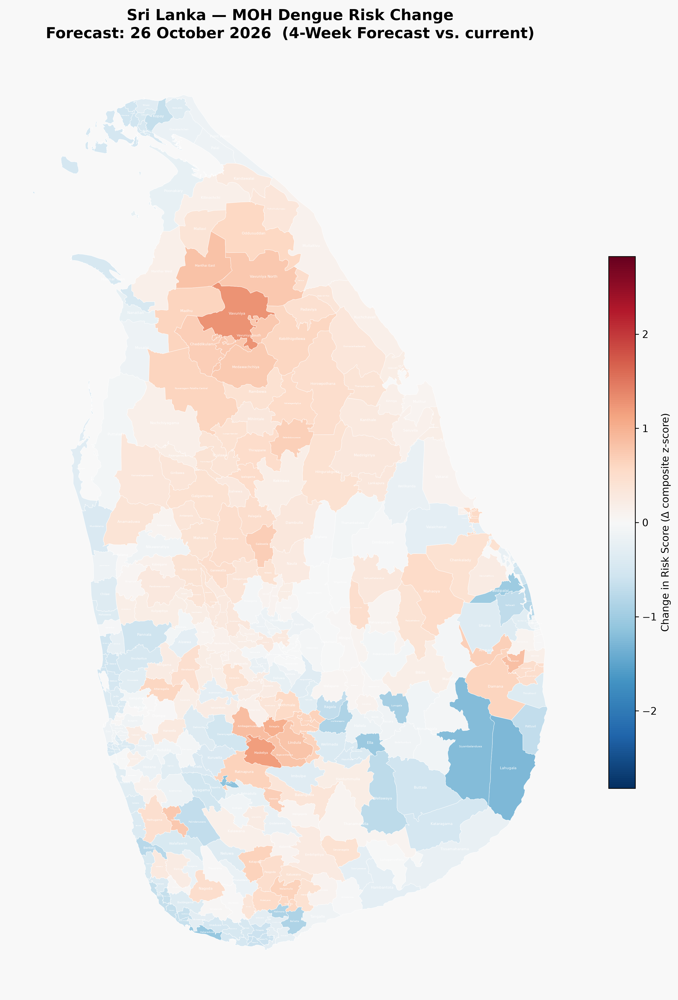

---

## Data Sources

- **Weather:** [Open-Meteo Historical Weather API](https://open-meteo.com/en/docs/historical-weather-api)
  (ERA5 / ERA5-Land reanalysis, 0.1°–0.25° resolution)
- **Region boundaries:** Ministry of Health Sri Lanka (333 MOH regions)
- **Model:** Erandi et al. (2021), *Int. J. Dynamical Systems and Differential Equations*, Vol. 11, Nos. 5/6, pp. 462–472.
